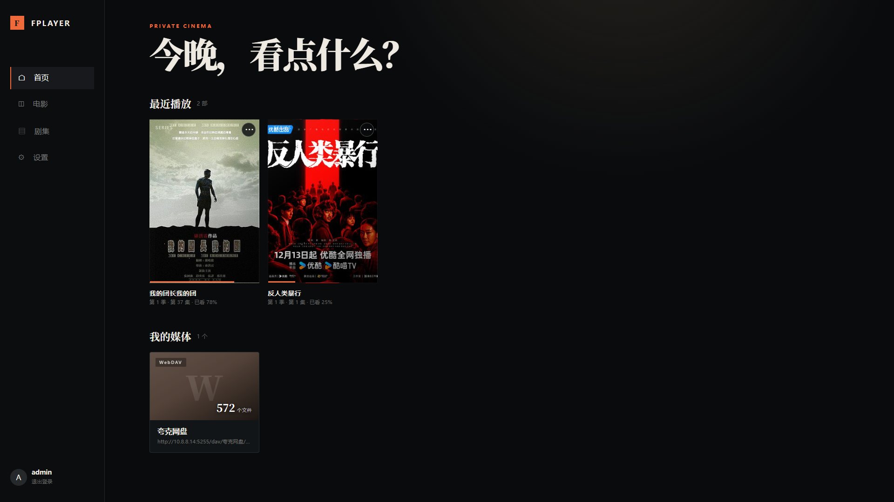
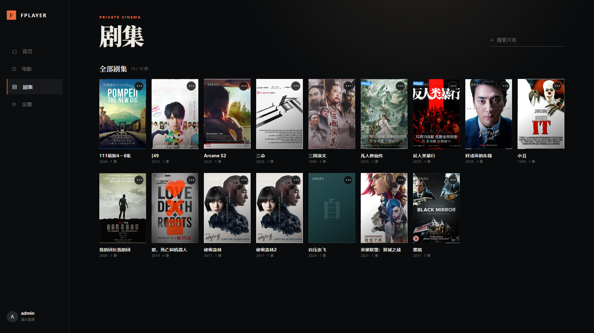
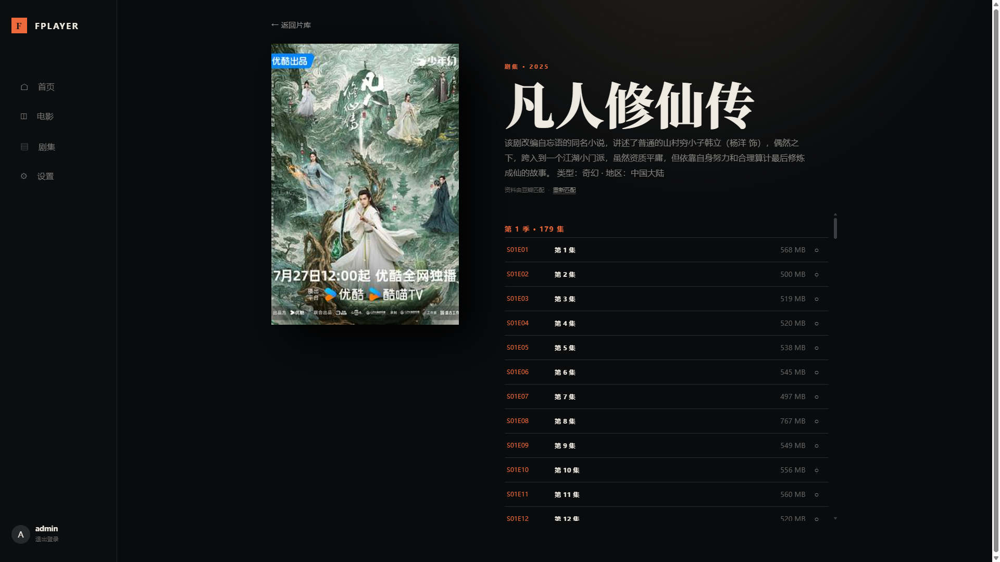

# FPlayer

面向个人 NAS 的自托管 Web 媒体播放器，支持本地目录与 WebDAV 媒体源。

## 界面预览

| 首页 | 剧集库 |
| :---: | :---: |
|  |  |

| 详情页（豆瓣元数据与剧集列表自动匹配） |
| :---: |
|  |

> [!WARNING]
> **部署前必读：必须修改 `APP_SECRET`**
>
> `docker-compose.yml` 中硬编码的 `APP_SECRET` 是项目作者本人的自用密钥，
> **已随公开仓库对外可见**。任何拿到该密钥的人，一旦同时获得你的数据库文件
> （`data/` 目录），就能解密你保存的所有 WebDAV 账号密码。
>
> 正式部署前**务必替换**，例如：
>
> ```bash
> openssl rand -hex 32   # 用生成结果替换 docker-compose.yml 中的 APP_SECRET
> ```
>
> 服务每次启动时也会在日志中检测并提醒。注意：替换密钥后，之前保存的
> WebDAV 密码将无法解密，需要重新填写一次。

## 当前 MVP

- 首次启动创建管理员账户
- 本地目录 / WebDAV 媒体源
- WebDAV 连接测试和递归扫描
- 电影 / 剧集基础识别
- 豆瓣元数据匹配（搜索 + 详情页解析、Cookie、防封禁、sec 验证）
- 媒体库、搜索、详情页
- 服务端媒体代理、HTTP Range 与 FFmpeg HLS 转码回退
- 播放进度和继续观看
- Docker 单容器部署

浏览器会优先直接播放兼容格式；无法直接播放时自动启动 FFmpeg，转为 H.264 + AAC 的 HLS 流。有 NVIDIA GPU 时默认自动启用 NVDEC/NVENC，无 GPU 或硬件编码不可用时回落到 CPU。

## 安装 FFmpeg / FFprobe

仓库与容器镜像均**不包含 FFmpeg 二进制**，需要自行准备。播放依赖两个命令行工具：

- `ffprobe`：探测媒体文件的编码与封装格式，播放器据此决定直接播放还是转码；
- `ffmpeg`：无法直接播放时启动 HLS 转码（CPU 走 `libx264` + `aac`，NVIDIA GPU 走 `h264_nvenc`）。

缺少任一工具时探针会失败并回落直接播放，转码不可用，日志出现 `spawn ffprobe ENOENT` / `ffprobe 启动失败`。服务通过环境变量定位二者：

| 环境变量 | 默认值 | 说明 |
| --- | --- | --- |
| `FFMPEG_PATH` | `ffmpeg`（沿 PATH 查找） | ffmpeg 可执行文件完整路径 |
| `FFPROBE_PATH` | `ffprobe`（沿 PATH 查找） | ffprobe 可执行文件完整路径 |

建议使用 4.x 及以上版本的**静态构建**；CPU 转码要求包含 `libx264` 与 `aac` 编码器（下列官方构建均自带），NVIDIA 硬件加速要求包含 NVENC（选 GPL 构建）。国内网络下载 GitHub Release 较慢时可借助常用加速方式。

### 各平台下载

- **Windows**：[gyan.dev](https://www.gyan.dev/ffmpeg/builds/) 下载 `ffmpeg-release-essentials.zip`，或 [BtbN FFmpeg-Builds](https://github.com/BtbN/FFmpeg-Builds/releases) 下载 `ffmpeg-master-latest-win64-gpl.zip`；解压取出 `bin/` 下的 `ffmpeg.exe` 与 `ffprobe.exe`。
- **macOS**：`brew install ffmpeg`。
- **Linux 宿主机直接运行**：`sudo apt install ffmpeg`，或用免安装的静态版 [johnvansickle.com/ffmpeg](https://johnvansickle.com/ffmpeg/)。
- **Docker / NAS 部署**：见下一小节（必须手动放入 `ffmpeg-static/` 目录）。

### Docker / NAS：放入 ffmpeg-static 目录

`docker-compose.yml` 默认把项目根目录下的 `./ffmpeg-static` 只读挂载到容器 `/ffmpeg-static`，并通过 `FFMPEG_PATH=/ffmpeg-static/ffmpeg`、`FFPROBE_PATH=/ffmpeg-static/ffprobe` 指向其中的二进制。容器内没有 ffmpeg，**跳过此步播放会失败**：

1. 下载 **Linux x86_64 静态构建**（ARM 架构 NAS 选 arm64 版本）：
   - NVIDIA GPU 转码（带 NVENC）：[BtbN FFmpeg-Builds](https://github.com/BtbN/FFmpeg-Builds/releases) 的 `ffmpeg-master-latest-linux64-gpl.tar.xz`；
   - 纯 CPU：[johnvansickle.com/ffmpeg](https://johnvansickle.com/ffmpeg/) 的 `ffmpeg-release-amd64-static.tar.xz`。
2. 解压取出 `ffmpeg`、`ffprobe` 两个文件，放入项目根目录的 `ffmpeg-static/`（与 `docker-compose.yml` 同级，目录需在启动容器前建好）：

   ```bash
   mkdir -p ffmpeg-static
   tar xf ffmpeg-master-latest-linux64-gpl.tar.xz
   cp ffmpeg-master-latest-linux64-gpl/bin/ffmpeg ffmpeg-master-latest-linux64-gpl/bin/ffprobe ffmpeg-static/
   chmod +x ffmpeg-static/ffmpeg ffmpeg-static/ffprobe   # 必须可执行，否则容器内无法运行
   ```

3. 按下文「NAS 部署」启动即可。若二进制放在其他目录，修改 compose 里的 `FFMPEG_PATH`/`FFPROBE_PATH` 并同步调整挂载路径。

### 本地开发：设置 FFMPEG_PATH / FFPROBE_PATH

两种方式任选其一，需在 `npm run dev` **之前**设置：

- **加入 PATH（推荐）**：把可执行文件所在目录加入系统 PATH。例如 Windows 解压到 `C:\ffmpeg` 后，把 `C:\ffmpeg\bin` 加入环境变量 Path，重开终端后 `ffmpeg -version` 有输出即可。
- **指定完整路径**（注意是可执行文件本身，不是目录）：

  ```powershell
  # PowerShell（仅当前会话有效）
  $env:FFMPEG_PATH = "C:\ffmpeg\bin\ffmpeg.exe"
  $env:FFPROBE_PATH = "C:\ffmpeg\bin\ffprobe.exe"
  npm run dev
  ```

  ```bash
  # bash / zsh（可写入 ~/.bashrc 或 ~/.zshrc 持久化）
  export FFMPEG_PATH=/opt/ffmpeg-static/ffmpeg
  export FFPROBE_PATH=/opt/ffmpeg-static/ffprobe
  npm run dev
  ```

验证：`ffmpeg -version`（或 `"$FFMPEG_PATH" -version`）能打印版本号；播放一个浏览器无法直接播放的文件（如 HEVC 或 MKV），确认能转码出图。

## 本地开发

运行前请先准备好 FFmpeg / FFprobe（见上文「安装 FFmpeg / FFprobe」）：

```bash
npm install
npm run dev
```

开发地址：`http://localhost:5173`

## NAS 部署

1. **修改 `docker-compose.yml` 中的 `APP_SECRET`（必须）**：仓库里的值是作者自用密钥，已在 GitHub 公开，直接部署有被解密 WebDAV 凭证的风险。用 `openssl rand -hex 32` 生成随机密钥替换。
2. **旧版本升级**：容器现以非 root 用户（uid 1000）运行。若 `data/` 目录是老版本（root 所有）产生的，首次启动前执行一次 `sudo chown -R 1000:1000 data`。
3. **准备 FFmpeg（转码必需）**：容器内不含 ffmpeg，需下载 Linux 静态构建放入项目根目录的 `ffmpeg-static/` 并 `chmod +x`，详见上文「Docker / NAS：放入 ffmpeg-static 目录」。
4. 如果使用 NAS 本地目录，挂载目录到容器内，例如 `/media`，并在媒体源中填写容器内路径。
5. 启动：

```bash
docker compose up -d --build
```

GPU 转码需要宿主机安装 NVIDIA 驱动与 NVIDIA Container Toolkit。可通过 `TRANSCODE_ACCELERATION=cpu` 强制关闭硬件加速；默认 `auto` 会在容器启动后首次转码时检测 GPU。

6. 打开 `http://NAS-IP:3000`，创建管理员。
7. 添加 WebDAV 地址或容器内本地目录，点击“测试”和“扫描”。

数据默认保存在项目目录的 `data/` 下，包含 SQLite 数据库和加密后的媒体源凭证。请定期备份该目录。

## 忘记密码

管理员密码无法找回，但可用脚本直接重置（需知道用户名；重置会清除该用户全部登录会话，请用新密码重新登录）：

```bash
# 容器部署
docker compose exec fplayer node dist-server/reset-password.js 用户名 新密码

# 宿主机本地运行（npm run dev 场景）
npm run reset-password -- 用户名 新密码
```
